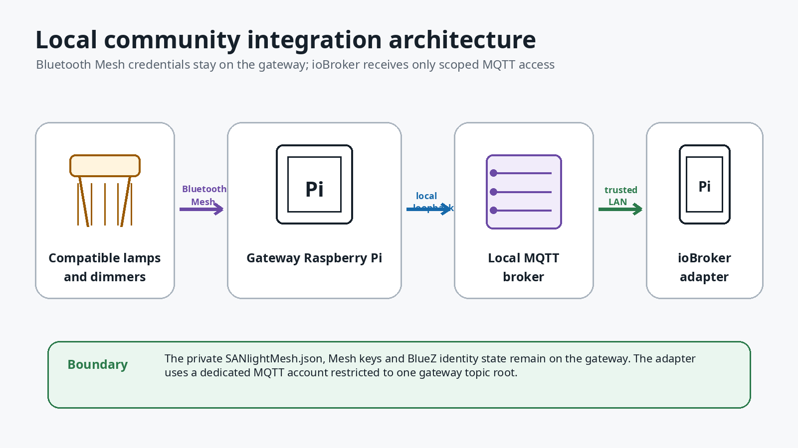

# ioBroker SANlight Mesh adapter

Native ioBroker integration for the community
[MQTT gateway for SANlight Mesh](https://github.com/Nibbels/sanlight-mesh-mqtt-gateway).

The gateway Raspberry Pi handles Bluetooth Mesh, SANlight credentials, safety
checks and the local Mosquitto broker. This adapter connects over the local
network and creates normal ioBroker devices, states and controls.

> Unofficial community project. Not affiliated with or endorsed by SANlight GmbH.
> The SANlight name is used only to identify compatible products and software.

## Architecture



The adapter never needs the private SANlight export, Mesh keys, SSH access or
BlueZ access.

## Before installation

Install the gateway first and confirm that this command reports a healthy
system:

```bash
sudo sanlight-gateway doctor
```

Gateway repository:

```text
https://github.com/Nibbels/sanlight-mesh-mqtt-gateway
```

## Install the adapter

In ioBroker Admin:

1. Open **Adapters**.
2. Choose **Install from custom URL**.
3. Enter:

```text
https://github.com/Nibbels/ioBroker.sanlightmesh
```

4. Install the adapter and create one instance for the gateway installation.

The generic ioBroker MQTT adapter is not required. Running both adapters for the
same topics creates an unnecessary second raw object tree.

## Configure the instance

Use the values printed by the gateway installer.

Required values:

| Setting       | Value                                                              |
| ------------- | ------------------------------------------------------------------ |
| Gateway host  | gateway Pi LAN IP/hostname, or `localhost` when both run on one Pi |
| MQTT username | generated ioBroker username                                        |
| MQTT password | protected password stored on the gateway Pi                        |
| Gateway ID    | exact ID chosen during gateway installation                        |

Keep the normal defaults unless you deliberately use another validated setup:

| Setting             | Default           |
| ------------------- | ----------------- |
| MQTT port           | `1883`            |
| Use MQTT TLS        | disabled          |
| Topic prefix        | `sanlightmesh/v1` |
| Command lifetime    | `30` seconds      |
| Brightness debounce | `1000` ms         |
| Explicit blackout   | disabled          |

Save and start the instance. A healthy connection has these states set to
`true`:

```text
info.mqttConnected
info.gatewayOnline
info.protocolCompatible
info.connection
```

Detected lamps appear below `lamps`.

## First safe test

Use a lamp's `control.refresh` button. This performs a read-only request through
the complete ioBroker → MQTT → gateway → Bluetooth Mesh path.

A successful result reports:

```text
lamps.<address>.command.lastStatus = verified
```

Only after this works should you test a small reversible MaxBrightness change in
the normal `20..100%` range and restore the original value.

## Current effective brightness

`lamps.<address>.state.liveBrightnessPercentEstimate` reports the lamp's current
effective output with one decimal place. A hardware comparison on 2026-07-17
showed `33.4%` in ioBroker while the SANlight app displayed `34%`; the app rounds
the same value to a whole percentage.

The lower-level raw vendor value remains part of MQTT API v1 for validation and
compatibility, but the adapter intentionally does not expose it as a separate
ioBroker state. The percentage remains an output indicator, not calibrated
watts, photon flux or PPFD.

## Lamp clocks

The adapter exposes the last observed lamp clock as whole seconds since midnight
and as `HH:MM:SS`. These are snapshots from an explicit lamp read or verified
write; they do not tick inside ioBroker.

Each lamp can either be synchronized to the gateway Raspberry Pi's current local
time with `control.syncClockNow`, or set to an arbitrary wall/virtual time through
`control.clockTargetSeconds` or `control.clockTargetTime` followed by
`control.applyClockTarget`. The all-lamp equivalents are below
`gateway.control`. Editing either target input does not write to Bluetooth Mesh.

`gateway.control.refreshInfo` refreshes the gateway's local-clock reference
without reading any lamp or consuming a Bluetooth Mesh sequence number. Lamp
clocks change only after an explicit sync or apply action.

## Multiple gateways

One adapter instance manages exactly one gateway ID and broker connection. Create another instance for another independent gateway Pi.

## Safety model

- Requested brightness and verified lamp state remain separate.
- Normal MaxBrightness is restricted to `20..100%`.
- Blackout is a separate workflow and remains disabled by default.
- Commands are non-retained, uniquely identified, short-lived and debounced.
- The gateway remains the final authority for validation, rate limits,
  snapshots and readback verification.

## Status

The documented topology was validated end to end on real Raspberry Pi hardware
on 2026-07-16 and 2026-07-17, including adapter startup, MQTT API v1 compatibility, object
creation, read-only refresh and reversible brightness writes. Version `0.2.0` is the immutable released baseline. Clock control is being developed for `0.3.0`; the adapter remains pre-1.0.

## Documentation

- [INSTRUCTIONS.md](INSTRUCTIONS.md) — operation, updates and troubleshooting
- [docs/OBJECT_MODEL.md](docs/OBJECT_MODEL.md) — complete ioBroker object model
- [SECURITY.md](SECURITY.md) — credentials and network boundaries
- [CHANGELOG.md](CHANGELOG.md) — notable changes
- [docs/RELEASING.md](docs/RELEASING.md) — maintainer release checklist

Maintainer and diagnostic references remain in the repository but are not
required for normal installation.

## License

MIT License. See [LICENSE](LICENSE).
